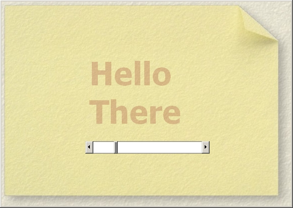



## Translucent Text

### Description

Control the transparency of text on a form. There are a lot of examples on PSC of Alphablend, GDI and transparency, but none brings all these together to demonstrate fading text or translucent text on a background.

This code uses only one picturebox. It copies the images to memory, prints text on the picturebox with the drawtext API and then alphablends the newly printed box with the original in memory to create translucence.
 
### More Info
 

             |
---                |---
**Submitted On**   |2007-05-29 07:10:44
**By**             |[David Stephens](https://github.com/Planet-Source-Code/PSCIndex/blob/master/ByAuthor/david-stephens.md)
**Level**          |Intermediate
**User Rating**    |5.0 (15 globes from 3 users)
**Compatibility**  |VB 6\.0
**Category**       |[Graphics](https://github.com/Planet-Source-Code/PSCIndex/blob/master/ByCategory/graphics__1-46.md)
**World**          |[Visual Basic](https://github.com/Planet-Source-Code/PSCIndex/blob/master/ByWorld/visual-basic.md)
**Archive File**   |[Translucen2067915292007\.zip](https://github.com/Planet-Source-Code/david-stephens-translucent-text__1-68692/archive/master.zip)

